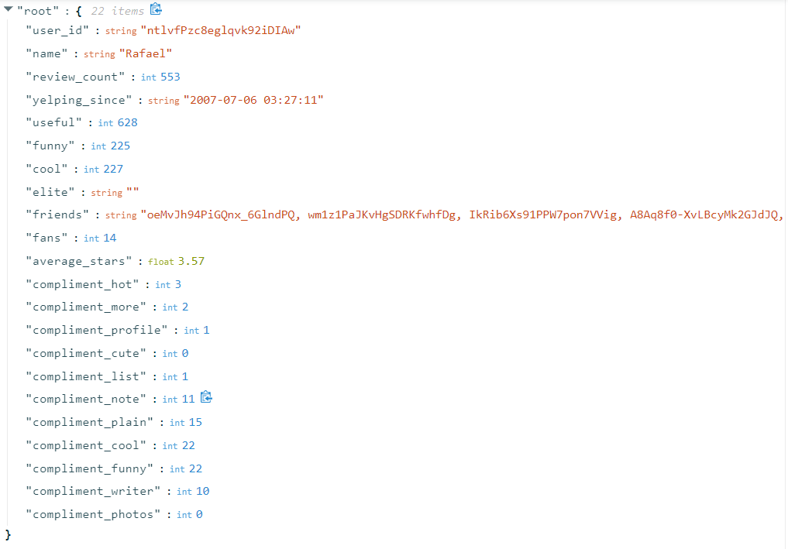
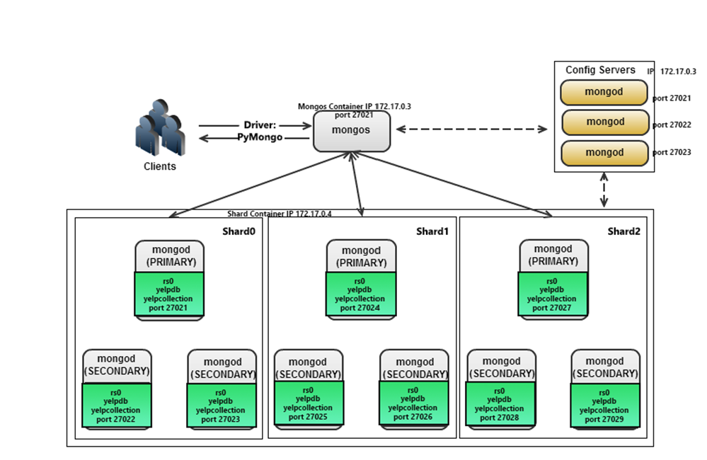

# Yelp_User_Management_Stimulator
In this project, our team design and implement a database application where a NoSQL database, MongoDB, is at the back-end. Our team may choose a high-level language, Python, and the corresponding driver, PyMongo, to implement the application. The application is a console-based.

### Dataset
Our used the dataset from the following website: https://www.kaggle.com/yelp-dataset/yelp-dataset?select=yelp_academic_dataset_user.json

### Setting Up
To run the program, it is first required to have MongoDB set up and running in a cluser where there is one mongos instance, config server (in a replica set of 3 members), and 3 sharding instances where each sharding instance is in a replica set of 3 members.

refer to https://github.com/phu-n-tran/Yelp_User_Management_Stimulator/blob/master/Setup%20Instructions.pdf for setting up instructions
